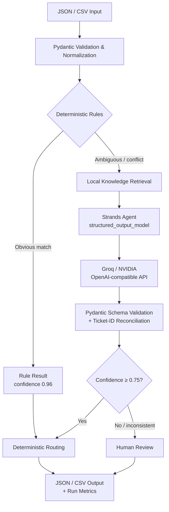
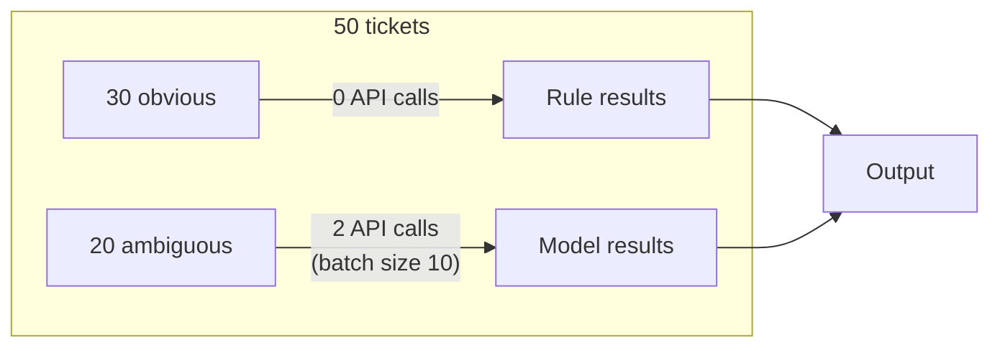

# Rooman Support Ticket Triage Agent

A reproducible, rule-first Python MVP for the Rooman AI Challenge. It validates support tickets, resolves narrow obvious cases without an API call, classifies unresolved tickets in batches with one Strands Agents classifier, applies deterministic routing and human-review policy, and writes structured JSON or CSV.

## What it does

- Accepts ticket `subject` + `body` with a unique `ticket_id`.
- Classifies category: `account_auth`, `billing`, `technical`, `product`, or `other`.
- Classifies urgency: `low`, `medium`, `high`, or `critical`.
- Produces bounded confidence, routing team, review status, reason, and decision source.
- Processes JSON/CSV batches, preserving input order.
- Avoids model calls for clear password/login, billing, outage, and feature-request phrases.
- Batches unresolved tickets (default 10/call), validates structured output, and fails closed to human review.
- Switches between Groq and NVIDIA NIM through environment configuration.
- Runs its core test suite and offline demo with no API key.

## Architecture



```text
JSON / CSV
    -> Pydantic input validation and normalization
    -> narrow conflict-aware deterministic rules
    -> unresolved chunks
    -> local knowledge retrieval (no API cost)
    -> one no-tools Strands Agent call per chunk (with knowledge context)
    -> Pydantic + ticket-ID reconciliation
    -> deterministic team routing
    -> confidence / inconsistency / failure review boundary
    -> JSON / CSV and privacy-safe run metrics
```

The LLM only returns category, urgency, confidence, and a concise reason. Python owns routing and human-review policy. There is one stateless classifier agent, no agent-to-agent calls, no validation model, and no routing model. A lightweight local knowledge base provides classification guidance in the prompt without additional API calls. See [Architecture](docs/ARCHITECTURE.md), [Agent design](docs/AGENT_DESIGN.md), and [schema](docs/DATA_SCHEMA.md).

## API efficiency



For `N` tickets, calls are approximately `ceil(unresolved / BATCH_SIZE)`, not `N`. Obvious tickets consume no call. Structured validation and routing happen locally; there is no second LLM judge. Concurrency defaults to one, and Strands throttling retries are exponentially backed off and bounded. The MVP intentionally has no persistent cache because ticket content may be sensitive; see [API cost strategy](docs/API_COST_STRATEGY.md).

Run metrics include request ID, ticket/source/review/failure counts, provider/model, batch size, API calls, retries, and latency. They exclude ticket subject/body and credentials.

## Why each component exists

| Component | Purpose | Why not something else? |
|---|---|---|
| **Deterministic rules** | Handle obvious tickets (auth, billing, outage, feature-request) at 0 API cost | Cheaper and more predictable than calling an LLM for clear-cut cases |
| **Local knowledge base** | Provide classification guidance (product vs technical boundary, escalation policy) in the prompt | No vector DB or external infrastructure needed; zero API cost |
| **Strands Agents SDK** | Orchestrate structured-output LLM classification with validated Pydantic schemas | Official framework; handles retries, streaming, and model abstraction |
| **Groq (default)** | Fast, reliable, OpenAI-compatible inference for llama-3.3-70b | 100% structured-output success rate, 3.9× faster than NVIDIA in benchmarks |
| **Pydantic validation** | Enforce schema at every boundary (input, model output, final result) | Catches malformed LLM responses before they reach routing |
| **Deterministic routing** | Map validated category + urgency to teams without LLM involvement | Prevents taxonomy drift; teams are operational decisions, not model guesses |

## Requirements mapping

| Challenge requirement | Implementation | Evidence |
|---|---|---|
| Accept subject + body | `models.Ticket` with Pydantic validation | `test_models.py` |
| Classify category | 5-category taxonomy in rules + LLM prompt | `test_rules.py`, `test_classifier.py` |
| Classify urgency | 4-level urgency in rules + LLM prompt | `test_rules.py` |
| Confidence score | Model-declared 0–1, finite-validated | `test_models.py`, `test_validator.py` |
| Routing decision | `router.route_ticket()` — deterministic | `test_router.py` |
| Human-review handling | Threshold + inconsistency + failure → review | `test_validator.py`, `test_classifier.py` |
| Batch processing | Chunked with order preservation | `test_batch.py` (100-ticket test) |
| Sample tickets | `samples/tickets.json` (6 tickets) | Committed artifact |
| Classified output | `samples/classified_output.json` | Live-generated |
| Decision boundary | Documented below with numbered rules | Matches `validator.py` logic |

## Decision boundary

1. Invalid fields are rejected at the boundary.
2. Exactly one strong deterministic category match with no cross-category vocabulary produces a rule result at confidence `0.96`.
3. Cross-category vocabulary signals (even without a second rule match) defer to the model.
4. Unresolved valid tickets are classified together in bounded chunks with local knowledge context.
5. Confidence below `0.75` by default requires human review.
6. `other`, conflicting rule evidence, or critical language inconsistent with model urgency requires review regardless of confidence.
7. Missing/duplicate/invented model IDs, malformed output, offline ambiguity, or provider failure produces a safe `other`/General Support fallback with confidence `0` and review required.

The threshold is a conservative operating boundary, not a calibrated probability. Production deployment requires calibration from reviewed labels.

## Sample: realistic input → output

**Input ticket:**
```json
{
  "ticket_id": "T-005",
  "subject": "Dashboard changed unexpectedly",
  "body": "A widget moved after the update and I cannot tell whether this is intended."
}
```

**Output (live Groq classification):**
```json
{
  "ticket_id": "T-005",
  "category": "product",
  "urgency": "low",
  "confidence": 0.80,
  "routing_team": "Product Support",
  "human_review": false,
  "reason": "The user is reporting an unexpected change in the dashboard after an update, which suggests a potential issue with the product's behavior or configuration.",
  "source": "llm"
}
```

**What happened:** No rule matched → knowledge base provided product/technical boundary guidance → Strands called Groq once → model returned structured JSON → Pydantic validated → confidence 0.80 ≥ 0.75 → routed to Product Support → no human review needed.

## Requirements

- Python 3.11+ (tested with Python 3.12.3)
- [`uv`](https://docs.astral.sh/uv/) recommended; `pip` also works
- An API key only for online classification of unresolved tickets

## Install

```bash
git clone https://github.com/ayushks1ngh/support-ticket-triage.git
cd support-ticket-triage
uv sync --extra dev
```

Alternative:

```bash
python -m venv .venv
source .venv/bin/activate
pip install -e '.[dev]'
```

Dependencies are exact-pinned in `pyproject.toml`; `uv.lock` captures the full resolved environment.

## Environment configuration

```bash
cp .env.example .env
```

Never commit `.env`. If a key has been pasted into chat, logs, or an issue, revoke it and create a new one before use.

### Groq

```dotenv
MODEL_PROVIDER=groq
MODEL_ID=llama-3.3-70b-versatile
GROQ_API_KEY=your_rotated_key
```

Groq uses its documented OpenAI-compatible endpoint. Verify that the configured model is currently enabled for your account.

### NVIDIA NIM

```dotenv
MODEL_PROVIDER=nvidia
MODEL_ID=nvidia/nemotron-3-nano-30b-a3b
NVIDIA_API_KEY=your_key
```

NVIDIA uses `https://integrate.api.nvidia.com/v1`. Model availability changes; set any compatible model your account supports.

Important settings:

| Variable | Default | Bound / purpose |
|---|---:|---|
| `HUMAN_REVIEW_THRESHOLD` | `0.75` | `0..1`; lower confidence is reviewed |
| `BATCH_SIZE` | `10` | `1..25` unresolved tickets per call |
| `MAX_CONCURRENCY` | `1` | `1..4`; sequential avoids rate-limit bursts |
| `MAX_RETRY_ATTEMPTS` | `3` | `1..5` total Strands attempts |
| `RETRY_INITIAL_DELAY_SECONDS` | `1` | first exponential-backoff delay |
| `RETRY_MAX_DELAY_SECONDS` | `8` | bounded delay cap |
| `MODEL_MAX_TOKENS` | `4096` | `256..16384` |
| `MODEL_TEMPERATURE` | `0.01` | near-deterministic classification |
| `REQUEST_TIMEOUT_SECONDS` | `30` | `5..120`; provider request timeout |
| `BATCH_DELAY_SECONDS` | `0` | `0..30`; pause between provider calls for rate-limit protection |

## Run

### Reproducible offline demo

Offline mode applies deterministic rules and sends every unresolved/ambiguous case to human review. It never pretends those cases were model-classified.

```bash
uv run support-triage classify \
  --input samples/tickets.json \
  --output outputs/results.json \
  --offline
```

CSV input requires `ticket_id,subject,body` headers; choose a `.csv` output path for CSV results:

```bash
uv run support-triage classify --input tickets.csv --output outputs/results.csv --offline
```

### Online batched classification

```bash
uv run support-triage classify \
  --input samples/tickets.json \
  --output outputs/results.json
```

CLI flags `--provider`, `--model-id`, `--threshold`, `--batch-size`, and `--batch-delay` override environment values. Invalid records are reported and cause exit code 2; valid records are still processed. JSON reports include structured record errors. CSV mode reports their count on stderr.

### Input

```json
[
  {
    "ticket_id": "T-001",
    "subject": "Cannot sign in",
    "body": "My account is locked and the password reset link expired."
  }
]
```

### Output

```json
{
  "ticket_id": "T-001",
  "category": "account_auth",
  "urgency": "high",
  "confidence": 0.96,
  "routing_team": "Account Support",
  "human_review": false,
  "reason": "Clear deterministic account_auth phrase matched.",
  "source": "rule"
}
```

See [`samples/classified_output.json`](samples/classified_output.json) for a complete report generated by the application.

## Test

```bash
uv run pytest -q
uv run ruff check .
uv run ruff format --check .
uv run mypy src
```

Current verified result (2026-08-16):

```text
82 passed, 1 skipped
Ruff: passed
mypy strict: passed (18 source files)
```

The skipped test is an opt-in live-provider smoke test. To run it with a newly issued credential:

```bash
RUN_LIVE_TESTS=1 uv run pytest -m live -q
```

No API key is needed for the default suite. Providers are replaced by deterministic fakes for model-output, chunking, failure, ID mismatch, low-confidence, and retry tests.

## Evaluate

```bash
uv run support-triage evaluate --dataset data/evaluation.json --offline
```

Measured offline baseline on the 8 versioned examples (2026-08-15):

| Metric | Result |
|---|---:|
| Exact category + urgency + route accuracy | 0.625 |
| Category accuracy | 0.750 |
| Urgency accuracy | 0.750 |
| Routing accuracy | 0.750 |
| Human-review precision | 0.500 |
| Human-review recall | 1.000 |
| API calls | 0 |
| Rule / model / fallback | 4 / 0 / 4 |

This deliberately conservative offline result is not a live-model quality claim: ambiguous cases are reviewed rather than guessed. Run the same command without `--offline` to measure a configured provider. Results vary by model and should be recorded with model ID and date.

## Verification status

| Check | Status |
|---|---|
| Offline tests (82 passed) | ✅ Verified |
| Sample/evaluation pipeline reproducible | ✅ Verified |
| API efficiency (no amplification) | ✅ Verified |
| Real provider structured-output conformance | ✅ Verified |
| Live model classification quality | ✅ Verified |
| Live latency | ✅ Verified |
| Live throttling/backoff behavior | ⏳ Not yet measured |

### Live evaluation (Groq, llama-3.3-70b-versatile, 2026-08-16)

| Metric | Offline | Live |
|---|---:|---:|
| Exact accuracy | 0.625 | 0.625 |
| Category accuracy | 0.750 | 0.750 |
| Urgency accuracy | 0.750 | 0.875 |
| Routing accuracy | 0.750 | 0.750 |
| Human-review precision | 0.500 | 0.500 |
| Human-review recall | 1.000 | 1.000 |
| API calls | 0 | 1 |
| Latency | ~2ms | ~1507ms |
| Rule / model / fallback | 4/0/4 | 4/4/0 |

### V1.3 expanded evaluation (105 tickets, live, 2026-08-16)

| Metric | Result |
|---|---:|
| Exact accuracy | 0.657 |
| Category accuracy | 0.867 |
| Urgency accuracy | 0.781 |
| Routing accuracy | 0.838 |
| Human-review precision | 0.552 |
| Human-review recall | 0.889 |
| API calls | 10 |
| Latency | ~89s |
| Rule / model / fallback | 13 / 92 / 0 |

## Security

- Keys are environment-only; `.env` and key files are ignored.
- Inputs, files, batch size, concurrency, retries, and outputs are bounded.
- Ticket text is untrusted prompt data; the agent has no tools or side effects.
- Model output is Pydantic-validated and reconciled to requested IDs.
- Provider errors are sanitized before output.
- Ticket contents are not logged.

Hosted online mode transmits unresolved subject/body text to the selected provider. The MVP does not implement PII redaction, encryption-at-rest, authentication, retention controls, tenant isolation, or compliance certification. Use synthetic data unless provider and organizational data handling are approved. See [Security](docs/SECURITY.md).

## Design tradeoffs and limitations

- Rules are intentionally small; paraphrases may use the model.
- Confidence is model-declared and uncalibrated.
- The five-category taxonomy is challenge-oriented, not organization-specific.
- Batching lowers calls but an entire malformed/failed chunk falls back to review.
- Provider/model tool-calling compatibility can vary despite OpenAI-compatible transport.
- CSV cannot embed record error objects; use JSON when detailed rejection data is needed.
- This is a local CLI/library prototype—not a service, queue consumer, or help-desk integration.
- Knowledge base is small (6 entries); production use requires broader coverage.
- Ticket history uses mock data; no real customer integration exists.

See [Tradeoffs](docs/TRADEOFFS.md) and [Roadmap](docs/ROADMAP.md) for future calibration, duplicate detection, queues, integrations, observability, feedback, and hardened security. Those features are intentionally outside the MVP.

## Project layout

```text
src/support_triage/       domain, rules, Strands agent, providers, batch, CLI, evaluation
tests/unit/               offline focused tests
tests/integration/        offline pipeline/CLI tests and opt-in live smoke test
data/evaluation.json      labeled evaluation fixtures
samples/                  runnable input and generated output
docs/                     PRD, requirements, design, security, tests, and roadmap
.kiro/                    concise steering and implementation spec
```

## Documentation

- [Requirements traceability](docs/REQUIREMENTS.md)
- [Architecture](docs/ARCHITECTURE.md)
- [Agent design](docs/AGENT_DESIGN.md)
- [LLM/Strands strategy](docs/LLM_STRATEGY.md)
- [Prompt specification](docs/PROMPT_SPEC.md)
- [Test plan](docs/TEST_PLAN.md)
- [Evaluation plan](docs/EVALUATION_PLAN.md)
