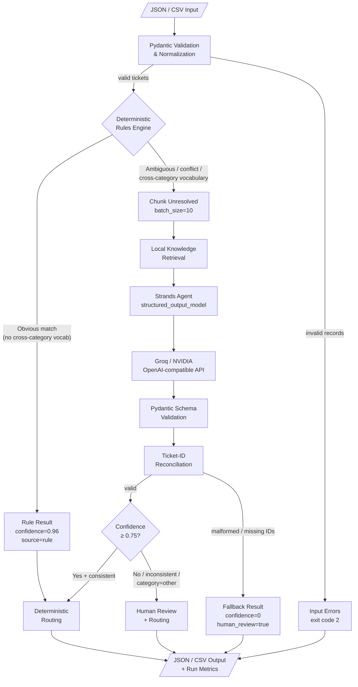

# Architecture

## Detailed flow diagram



## Runtime flow

```text
JSON/CSV -> Pydantic input validation -> normalization
         -> narrow conflict-aware deterministic rules (obvious cases only)
         -> unresolved-ticket chunks
         -> local knowledge retrieval (no API cost)
         -> one Strands structured-output call/chunk (with knowledge context)
         -> schema + semantic validation -> deterministic routing
         -> confidence/inconsistency/provider-failure review boundary
         -> JSON/CSV + run metrics
```

## Components
- `models.py`: enums and Pydantic boundary models.
- `knowledge.py`: local keyword-search knowledge base and ticket history lookup.
- `config.py`: environment configuration and bounds.
- `rules.py`: small, conflict-aware obvious-case classifier.
- `agent.py`: prompt and supported Strands structured-output invocation.
- `providers/`: provider abstraction and OpenAI-compatible Groq/NVIDIA adapters.
- `validator.py`: semantic checks and final review decision.
- `router.py`: deterministic category-to-team routing.
- `classifier.py`: rule-first single/chunk orchestration.
- `batch.py`: chunking, order preservation, failure isolation, metrics.
- `io.py` / `cli.py`: JSON/CSV input/output and commands.
- `evaluation.py`: measured evaluation reporting.

## Key decisions
- One classifier agent, no tools and no multi-agent graph. Strands orchestrates structured model inference only.
- A lightweight local knowledge base provides classification context in the prompt without additional API calls.
- Rules require strong phrase evidence, reject cross-category conflicts, and check for vocabulary signals from other categories before finalizing. They are an optimization, not a general NLP system.
- Model output does not choose the team; Python routing prevents taxonomy drift.
- A batch schema lets one call classify several unresolved tickets. Chunk size limits prompt/output risk. Processing is sequential by default (`MAX_CONCURRENCY=1`) to avoid rate-limit bursts.
- Provider failures become per-ticket human-review results, preserving batch progress.
- No persistent cache in MVP: ticket content may be sensitive and naive caches create retention risk. Rule bypass and batching provide the primary call savings.

## Dependency direction
CLI -> I/O + Batch -> Classifier -> Rules / Provider -> Strands. Domain models and routing remain provider-independent.

## Deployment boundary
This is a local CLI/library prototype, not a network service. External API transmission occurs only for unresolved ticket subject/body when an online provider is selected.
